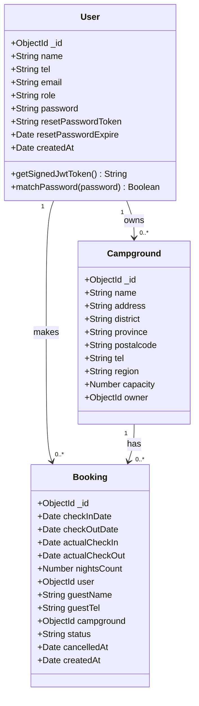
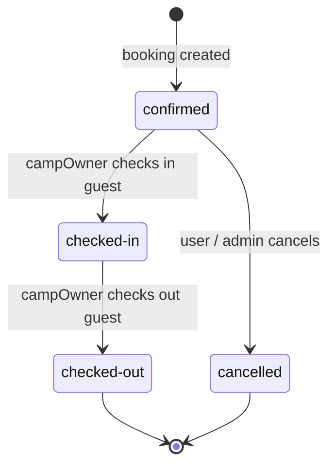

# Seraja Campground Booking API

Backend REST API for the Seraja campground booking platform. Built with Node.js, Express, and MongoDB.

## Tech Stack

- **Runtime**: Node.js
- **Framework**: Express
- **Database**: MongoDB (via Mongoose)
- **Auth**: JWT (stored in HTTP-only cookies)
- **Deployment**: Vercel

---

## Data Models

The three core Mongoose models and their relationships:



**Notes:**
- `User.password` is hashed via bcryptjs and excluded from query results (`select: false`)
- `User.role` ∈ `{ user, campOwner, admin }`
- `Booking.user` is nullable — a booking belongs to either a registered `User` **or** a walk-in guest (`guestName` + `guestTel`), never both
- `Campground.bookings` is a virtual reverse-populate (not stored in the document)

---

## Getting Started

### Prerequisites

- Node.js
- MongoDB instance (local or Atlas)

### Installation

```bash
npm install
```

### Environment Variables

Create a `config/config.env` file:

```env
NODE_ENV=development
PORT=5000

MONGO_URI=<your_mongodb_connection_string>

JWT_SECRET=<your_jwt_secret>
JWT_EXPIRE=30d
JWT_COOKIE_EXPIRE=30
```

### Running

```bash
# Development (with nodemon)
npm run dev

# Production
npm start
```

Server runs on `http://localhost:5000` by default.

---

## API Reference

Base URL: `/api/v1`

### Authentication

| Method | Endpoint | Access | Description |
|--------|----------|--------|-------------|
| POST | `/auth/register` | Public | Register a new user |
| POST | `/auth/login` | Public | Login and receive JWT cookie |
| GET | `/auth/me` | Private | Get current logged-in user |
| GET | `/auth/logout` | Private | Logout and clear cookie |

#### Register / Login body

```json
{
  "name": "string",
  "email": "string",
  "tel": "string",
  "password": "string",
  "role": "user | campOwner | admin"
}
```

---

### Campgrounds

| Method | Endpoint | Access | Description |
|--------|----------|--------|-------------|
| GET | `/campgrounds` | Public | Get all campgrounds |
| GET | `/campgrounds/:id` | Public | Get single campground |
| POST | `/campgrounds` | admin | Create a campground |
| PUT | `/campgrounds/:id` | admin, campOwner | Update a campground |
| DELETE | `/campgrounds/:id` | admin | Delete a campground |

#### Campground body

```json
{
  "name": "string",
  "address": "string",
  "district": "string",
  "province": "string",
  "postalcode": "string (max 5 digits)",
  "tel": "string",
  "region": "string",
  "capacity": "number (default: 5)",
  "owner": "userId"
}
```

---

### Bookings

| Method | Endpoint | Access | Description |
|--------|----------|--------|-------------|
| GET | `/bookings` | Private | Get bookings (scoped by role) |
| GET | `/bookings/export` | admin, campOwner | Export bookings as CSV |
| GET | `/bookings/:id` | Private | Get single booking |
| POST | `/campgrounds/:campgroundId/bookings` | admin, user, campOwner | Create a booking |
| PUT | `/bookings/:id` | admin, user, campOwner | Update a booking |
| DELETE | `/bookings/:id` | admin, user, campOwner | Delete a booking |
| PUT | `/bookings/:id/cancel` | admin, user, campOwner | Cancel a booking |
| PUT | `/bookings/:id/checkin` | campOwner | Check in a guest |
| PUT | `/bookings/:id/checkout` | campOwner | Check out a guest |

#### Booking body (registered user)

```json
{
  "checkInDate": "YYYY-MM-DD",
  "checkOutDate": "YYYY-MM-DD"
}
```

#### Booking body (walk-in guest, campOwner/admin only)

```json
{
  "checkInDate": "YYYY-MM-DD",
  "checkOutDate": "YYYY-MM-DD",
  "guestName": "string",
  "guestTel": "string"
}
```

---

## Business Rules

- **Stay duration**: 1–3 nights per booking
- **Capacity check**: Bookings are rejected if the campground is at full capacity for any night in the requested range
- **Concurrent check-ins**: Maximum 5 simultaneous checked-in bookings per campground
- **Booking scopes**:
  - `user` — sees only their own bookings
  - `campOwner` — sees bookings for their campgrounds
  - `admin` — sees all bookings
- **Cancellation**: Only allowed on `confirmed` bookings; checked-in or checked-out bookings cannot be cancelled

### Booking Status Flow



---

## Security

- `helmet` — HTTP security headers
- `express-mongo-sanitize` — NoSQL injection prevention
- `express-xss-sanitizer` — XSS sanitization
- `hpp` — HTTP parameter pollution prevention
- `express-rate-limit` — 100 requests per 10 minutes per IP
- `bcryptjs` — Password hashing
- `cors` — Cross-origin resource sharing enabled