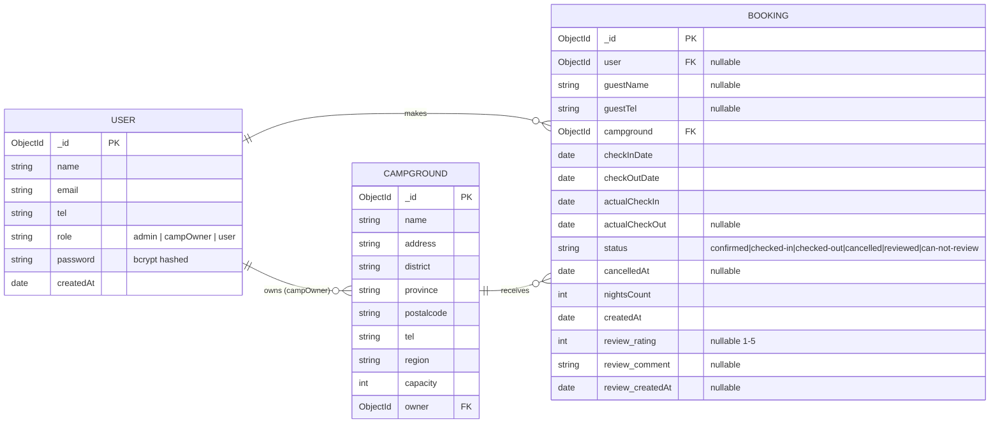

# Adapted ERD

```mermaid
erDiagram
	direction LR
	USER {
		ObjectId _id PK ""  
		string name  ""  
		string email  ""  
		string tel  ""  
		string role  "admin | campOwner | user"  
		string password  "bcrypt hashed"  
		date createdAt  ""  
	}

	CAMPGROUND {
		ObjectId _id PK ""  
		string name  ""  
		string address  ""  
		string district  ""  
		string province  ""  
		string postalcode  ""  
		string tel  ""  
		string region  ""  
		int capacity  ""  
		ObjectId owner FK ""  
	}

	BOOKING {
		ObjectId _id PK ""  
		ObjectId user FK "nullable"  
		string guestName  "nullable"  
		string guestTel  "nullable"  
		ObjectId campground FK ""  
		date checkInDate  ""  
		date checkOutDate  ""  
		date actualCheckIn  ""  
		date actualCheckOut  "nullable"  
		string status  "confirmed|checked-in|checked-out|cancelled|reviewed|can-not-review"  
		date cancelledAt  "nullable"  
		int nightsCount  ""  
		date createdAt  ""  
		int review_rating  "nullable 1-5"  
		string review_comment  "nullable"  
		date review_createdAt  "nullable"  
	}

	USER||--o{CAMPGROUND:"owns (campOwner)"
	USER||--o{BOOKING:"makes"
	CAMPGROUND||--o{BOOKING:"receives"
```