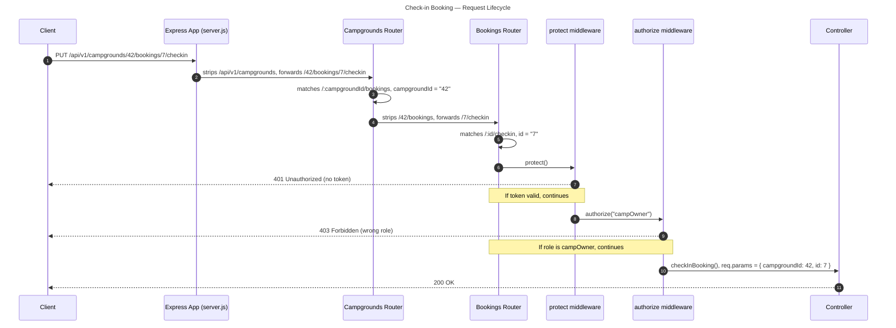

# Check-in Booking — Request Lifecycle

```mermaid
---
title: Check-in Booking — Request Lifecycle
---
sequenceDiagram
    autonumber

    participant Client
    participant App as Express App (server.js)
    participant CG as Campgrounds Router
    participant BK as Bookings Router
    participant Auth as protect middleware
    participant Authz as authorize middleware
    participant Ctrl as Controller

    Client->>App: PUT /api/v1/campgrounds/42/bookings/7/checkin

    App->>CG: strips /api/v1/campgrounds, forwards /42/bookings/7/checkin

    CG->>CG: matches /:campgroundId/bookings, campgroundId = "42"

    CG->>BK: strips /42/bookings, forwards /7/checkin

    BK->>BK: matches /:id/checkin, id = "7"

    BK->>Auth: protect()
    Auth-->>Client: 401 Unauthorized (no token)

    Note over Auth,BK: If token valid, continues

    Auth->>Authz: authorize("campOwner")
    Authz-->>Client: 403 Forbidden (wrong role)

    Note over Authz,BK: If role is campOwner, continues

    Authz->>Ctrl: checkInBooking(), req.params = { campgroundId: 42, id: 7 }

    Ctrl-->>Client: 200 OK
```